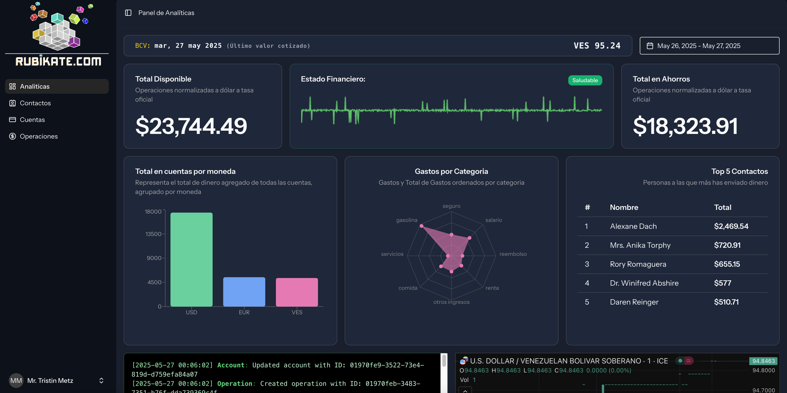

# Kwik

Kwik es una aplicación que toma tus finanzas y las convierte en descubrimientos accionales.

Si tú:

- No sabes cuánto estás gastando mensualmente
- No sabes cuánto estás ingresando mensualmente
- No sabes en qué estás gastando tu dinero
- No sabes cuánto porcentaje representa una determinada categoría de gasto/ingreso
- Quieres ver todos tus movimientos en un solo lugar
- Compartir estados de cuenta con tu contador de manera sencilla

Kwik es una aplicación para tí.
Esta aplicación hecha en Laravel + React (Inertia).

## REQUISITOS PARA ARRANCAR EL PROYECTO

- Tener Node.js 24.0.2 (LTS)
- Tener PHP 8.2.12 o superior
- Tener XAMPP v3.3.0 o superior
- Instalar Composer

## PASOS PARA ARRANCAR EL PROYECTO

- En phpmyadmin, crea una base de datos llamada `kwik`.
- Crea un archivo .env basado en el archivo `.env.example` (debes crear un servicio en https://pydolarve.org/ y usarlo como API_DOLAR_TOKEN)
- Ejecuta `composer install`
- Ejecuta `npm install`
- Ejecuta `php artisan key:generate`
- Ejecuta `php artisan custom:flush-and-seed`
- Visita `http://127.0.0.1:8000/`

Copy the environment file
`php artisan key:generate`
`composer install` para instalar las dependencias de composer
`npm install` para instalar las dependencias de node js

1. `composer run dev` -> Para ejecutar el Frontend
2. `php artisan dev` -> Para ejecutar el Backend
3. Visita `http://127.0.0.1:8000/`
